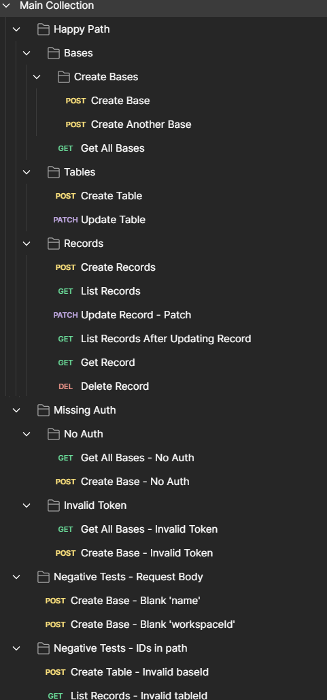

# REST API Testing (WIP)
**Testing the Airtable REST API with Postman**

## What Tests Include
1. Status code assertions
2. Response assertions: structure, fields, values
3. Passing values between requests with collection variables
4. Storing secrets in the local vault
5. Auth

## The Collection
### Happy Path
1. Create Base
2. Create Another Base
3. Get All Bases
4. Create Table
5. Update Table
6. Create Records
7. List Records
8. Update Record - Patch
9. List Records After Updating Record
10. Get Record
11. Delete Record

### Missing Authentication
1. Get All Bases - No Auth
2. Create Base - No Auth
3. Get All Bases - Invalid Token
4. Create Base - Invalid Token

### Negative Tests - Request Body
1. Create Base - Blank 'name'
2. Create Base - Blank 'workspaceId'

### Screenshots

